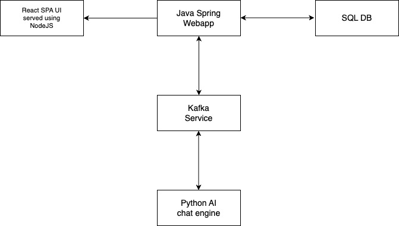

# Simple Chatbot Application

## Overview

A simple chatbot application in which the user can communicate with an AI based chat engine. The purpose of this application is to implement an application using the microservice architecture.

## Capabilities

It has chat rooms in which the user can start communicating with the AI engine about a particular topic.

## Architecture

1. For the UI, it uses a ReactJS based SPA. This app is served using a NodeJS server.
2. The web requests are handled by a Java Spring App.
3. The chat room conversations are persisted in SQL DB.
4. Chat responses are generated by an AI chat engine implemented in python.
5. The chat messages from the user and the chat responses from the AI engine are both communicated via Kafka Queues.

### Architecture Diagram

## Tech Stack

1. ReactJS for SPA UI app.
2. NodeJS for serving the React UI app.
3. Java Spring for webapp.
4. SQL DB for persistence.
5. Python app for AI chat engine.
6. Kafka service for communication between Java webapp and AI chat engine.
7. Docker for containerizing each microservice.
8. Kubernetes for managing the components of the app.
